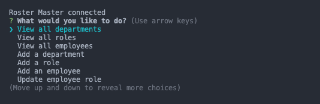

# Roster Master

  [

  ## Description

  Roster Master is a MySQL-based application that can be used to maintain a database of employees. You have the ability to add new employees, new roles, new departments, and update an employee's role if they move to a new position. This is all managed from the command line for easy access.

  ## Table of Contents

  * [Installation](#installation)
  * [Usage](#usage)
  * [Walkthrough](#walkthrough)
  * [Testing](#testing)
  * [License](#license)
  * [Questions](#questions)
  
  ## Installation

  Follow these steps for installing this project:

  1. Install node.js and MySQL if not already installed.
  2. Clone the repository to your machine and navigate to the application folder from the command line.
  3. Use the command `npm init` or `npm init -y` to set up the node package manager.
  4. Once complete use the command `npm i` to install the needed packages.
  5. Create a `.env` file at the root of the application folder to hold your MySQL login information.
  6. Update the seed and schema files to fit your needs.
  7. Open the MySQL shell using the command `mysql -u root -p` and login with your password.
  8. Run the commands `source db/schema.sql;` and `source db/seeds.sql;` in that order to set up the database and seed your information.

  ## Usage

  To open the application run the command `npm start`. You'll see this propmt when the application has loaded:

  

  From there you will make your choice and the application will walk you through add or editing as needed.

  ## Walkthrough

For a walkthrough video of using this application click [here](https://drive.google.com/file/d/14jHs1YWcS78cCLGysiGDjCKCNECw4d0h/view?usp=sharing).

  ## License

  This project is licensed with Mozilla Public License 2.0.

  ## Questions

  If you have questions about this project please contact me at [crawleyj2@gmail.com](mailto:crawleyj2@gmail.com).
  More of my work can be found on GitHub at [crawleyj2](https://github.com/crawleyj2)

